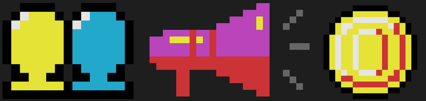
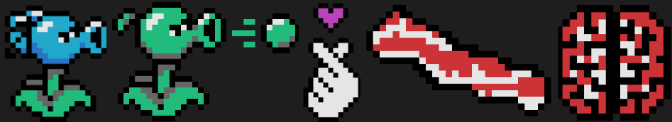
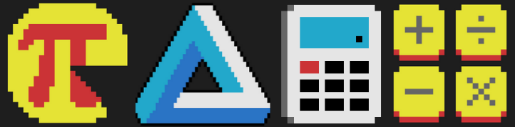
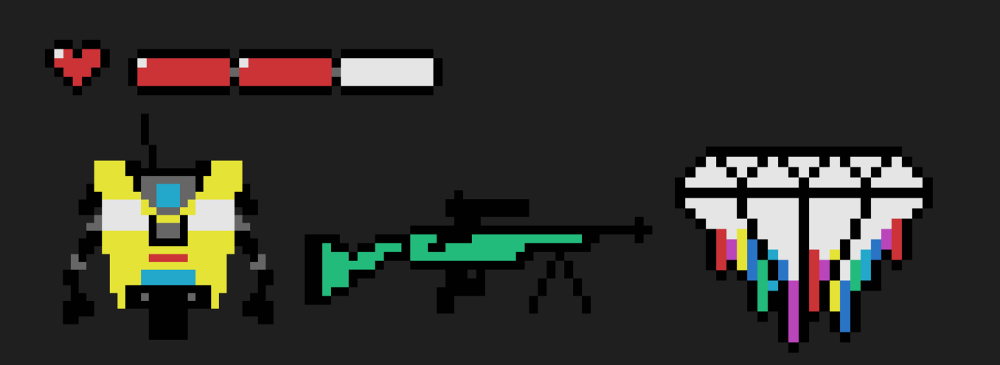
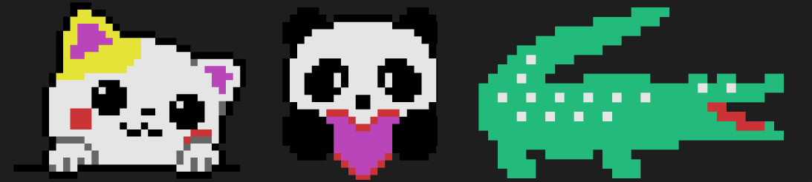
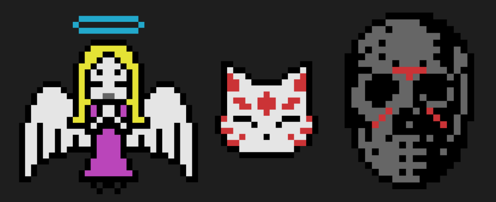

# JPP du CPP
```
🎴 Flowers do not return in the spring, rather they are replaced. It is in this 
difference between returned and replaced that the price of renewal is paid. 
And as it is for spring flowers, so it is for us. 🌸
```
Fini le C ! On se met maintenant au **C++**, un tout autre paradigme de langage de code !
Fini le langage procedural et dites bonjour a la *Programmation Orientee Objet* (POO), le *polymorphisme*, l'*encapsulation*, les *variables de reference* et les *surcharges* (et pleins d'autres trucs merveilleux) !

# MAIS JE PIGE RIEN DE TOUT CA ?!! 🤧

C'est normal ! Mais pour decouvrir un tout nouveau langage, il faut se confronter a des paves de **documentation** 📚 (noooooon), surtout que les modules doivent etre codes exclusivement en *C++98*. D'ailleurs une petite intro sur l'origine du langage peut etre interessante :
* https://zestedesavoir.com/tutoriels/822/la-programmation-en-c-moderne/le-debut-du-voyage/5176_le-c-quest-ce-que-cest/

Voici quelques liens de documentation qui pourraient vous accompagner tout au long de vos elaborations de codes et de vos decouvertes :
* LE FAMEUX LIEU DE DOCUMENTATION DE REFERENCE : https://en.cppreference.com/w/cpp (existe aussi en version francaise, mais il y a beaucoup moins d'articles...)
* Les videos de l'intra de 42 qui initient bien a la decouverte de ce merveilleux langage 📼 : https://elearning.intra.42.fr/tags/38/notions
* Pas de norme sur les modules ! Mais il est recommandable tout de meme de bien coder efficacement et clairement. Les conseils de l'ANSSI (Agence Nationale de la Securite des Systemes d'Information, ce n'est pas rien) 🚨 vous y aident : https://www.ssi.gouv.fr/uploads/2020/05/anssi-guide-regles_de_programmation_pour_le_developpement_securise_de_logiciels_en_langage_c.pdf 
* Un beau site simpliste qui permet de naviguer dans l'ensemble des bibliotheques de C++ : https://devdocs.io/cpp/
* Un FAQ trop bien complet : http://www.parashift.com/c++-faq-lite/

# 🧑‍🏫   MODULE 00 - Namescapes, classes, fonctions membres, stdio, streams, listes d'initialisation, static, const, et autres bases



## Namescapes

* http://sdz.tdct.org/sdz/les-espaces-de-noms-namespace.html

## Classes

* https://www.geeksforgeeks.org/c-classes-and-objects/

## Const

* Pourquoi utiliser _const_ ? : https://www.cprogramming.com/tutorial/const_correctness.html

## Getline

* Pourquoi std::getline() casse les couilles : https://www.journaldev.com/39743/getline-in-c-plus-plus

# 🧠   MODULE 01 - Allocation de memoire, pointeurs vers membres, references, switch



## New And Delete

* https://www.geeksforgeeks.org/new-and-delete-operators-in-cpp-for-dynamic-memory/

## Pointeurs & References

* Difference entre pointeurs et references : https://waytolearnx.com/2018/09/difference-entre-pointeur-et-reference.html
* Aide-memoire syntaxique des pointeurs et des references : https://cdiese.fr/cpp-pointer-reference/

## Switch / Case / Default

* https://fr.acervolima.com/instruction-switch-en-c-c/

# 🏋️   MODULE 02 - Polymorphisme ad-hoc, surcharge d’opérateurs et forme canonique



## Heritages et polymorphismes

* http://robert.cireddu.free.fr/SNIR/Cours%20sur%20heritage%20et%20le%20polymorphisme.pdf

## Surcharge d'operateurs et forme canonique

* Un tres bon resume des notions et des exceptions : https://cpp.developpez.com/cours/cppavance/
* https://learntutorials.net/fr/cplusplus/topic/562/surcharge-de-l-operateur
* http://lacl.univ-paris12.fr/cegielski/CPP/ch6.pdf
* Comment implementer les surcharges d'operateurs d'incrementation : https://docs.microsoft.com/fr-fr/cpp/cpp/increment-and-decrement-operator-overloading-cpp?view=msvc-170

## Nombres a virgule fixe

* https://www.youtube.com/watch?v=S12qx1DwjVk
* https://youtu.be/bDkR-OQiWx0
* https://books.google.fr/books?id=shU5EAAAQBAJ&pg=PA10&lpg=PA10&dq=Codage+en+virgule+fixe+bac&source=bl&ots=OJmNEGQgkf&sig=ACfU3U3XJh6xVb0rXgo-A9WAJuDnLsk1og&hl=fr&sa=X&ved=2ahUKEwiv57zzlrn4AhU-gc4BHbbuCLcQ6AF6BAgUEAM#v=onepage&q=Codage%20en%20virgule%20fixe%20bac&f=false

## Binary Space Partitioning (BSP)

* Comment determiner un point s'il est dans un triangle ? https://www.gamedev.net/forums/topic.asp?topic_id=295943
* Calculateur du BSP : https://planetcalc.com/8108/

# 💰   MODULE 03 - Heritage



## Heritage simple 

* Le celebre exemple du chien et l'oiseau qui sont des animaux : http://igm.univ-mlv.fr/~chilowi/lectures/content/cpp/course/virtual.std.html

## Heritage multiple

* Un petit cours explicatif sur l'heritage multiple : https://ressources.unisciel.fr/algoprog/s28hmult/emodules/hm00micours1/res/hm00cours-texte-cpp.pdf
* Exposition du probleme de diamant : https://en.wikipedia.org/wiki/Multiple_inheritance#The_diamond_problem
* A quoi ca sert de mettre un virtual class : https://www.geeksforgeeks.org/virtual-base-class-in-c/

# 😸   MODULE 04 - Polymorphisme par sous-typage, classes abstraites, interfaces



## Polymorphisme

* Ultra bon recap des notions d'heritage, de classes et du polymorphisme : https://www.labri.fr/perso/bourqui/downloads/cours/AP2/support-C%2B%2B-classes.pdf
* Ca aussi c'est super cool : https://h-deb.clg.qc.ca/Sujets/Divers--cplusplus/Polymorphisme.html
* Pourquoi mon polymorphisme ne marche pas ? : https://sites.google.com/site/steveyegge2/when-polymorphism-fails

## Virtual or not virtual

* Un constructeur peut-il etre virtual ? : https://www.tutorialspoint.com/virtual-constructor-in-cplusplus
* Et du coup, un deconstructeur peut-il etre aussi virtual ? : https://www.geeksforgeeks.org/virtual-destructor/
* Quand devrait-on marquer un destructeur comme étant virtual ? : https://h-deb.clg.qc.ca/Sujets/TrucsScouts/Destructeurs-virtuels-quand.html

# 🧑‍💻   MODULE 05 - Repetitions et exceptions


## Exceptions

* Suivez cette page de A a Z et vous comprendrez tout sur les exceptions : https://h-deb.clg.qc.ca/Sujets/Divers--cplusplus/CPP--Exceptions.html
* Comment declarer une classe d'exception ? : https://developpement-informatique.com/article/366/la-gestion-dexceptions-en-c++---declaration--utilisation-et-personnalisation

# 🛐   MODULE 06 - Opérateurs de conversion



* La base de tout : https://www.open-std.org/jtc1/sc22/wg21/docs/papers/1993/N0349a.pdf
* Un autre truc plus cool à lire : https://arne-mertz.de/2015/01/a-casting-show/
* Mais c'est quoi la différence entre les différents opérateurs (genre static et dynamic) ? : https://prograide.com/pregunta/306/casting-regulier-vs-static_cast-vs-dynamic_cast

# 🖼️   MODULE 07 - Templates

* Qu'est-ce qu'un fichier tpp ? : https://filebox.ece.vt.edu/~ECE2574/faq.html

